# Auswärtiges Amt
## Sprachen in der App

--

## Agenda

1. Vorstellung<!-- .element: class="fragment" data-autoslide="200" -->
1. Problemstellung der Sprachauswahl in der App<!-- .element: class="fragment" data-autoslide="200" -->
1. Vergleichbare Apps und Systemumgebung<!-- .element: class="fragment" data-autoslide="200" -->
1. Ansätze zur Sprachauswahl-Optimierung<!-- .element: class="fragment" data-autoslide="200" -->
1. Optimierungsmöglichkeiten für mögliche Updates<!-- .element: class="fragment" data-autoslide="200" -->
1. Nächste Schritte<!-- .element: class="fragment" -->

---

## Vorstellung

---

## Problemstellung der Sprachauswahl

--

## Einführung

--

Reader-App

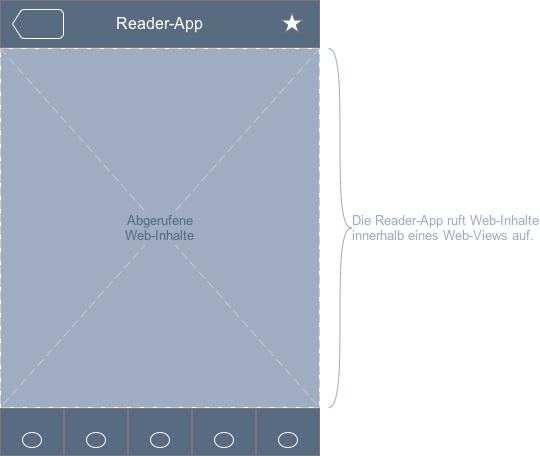

--

Sprach-Container

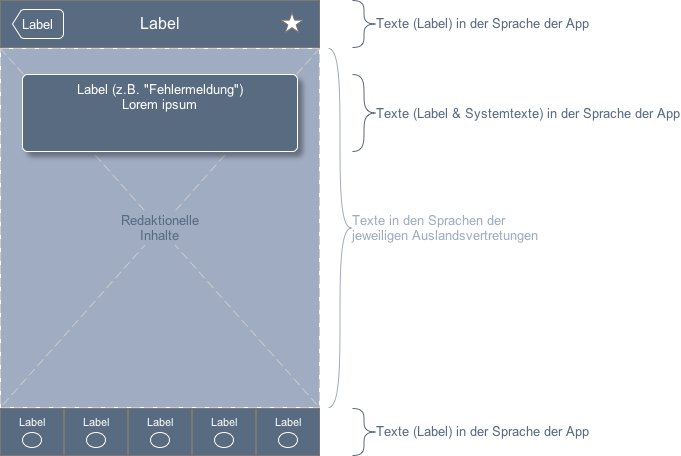

--

Kombinationsbeispiele

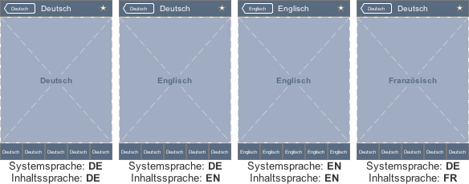

--

## Problemstellung

--

Die Systemeinstellung für die Sprache wird ignoriert.

--

Redaktionelle Inhalte werden auf Deutsch abgerufen.

--

Redaktionelle Inhalte und der Navigationsrahmen werden nach Sprachwahl zugleich ausgetauscht.

--

Bei Verlassen einer Auslandsvertretung wechselt die App generell auf Deutsch.

--

Meist ist nur eine Sprache in der Auswahlliste.

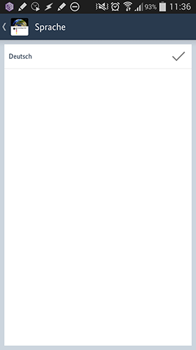

--

Selten sind drei Sprachen in der Auswahlliste.

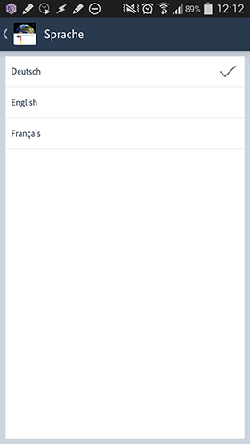

--

Ab und zu ist keine Sprache aufgelistet.

--

Nutzer bekommen den Eindruck, es gäbe allgemein die erstmalig gesehenen Sprachen zur Auswahl.

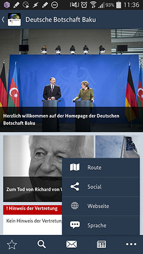

---

## Vergleichbare App: Wikipedia

--

Navigationsrahmen und Inhalt entsprechen der Systemsprache.

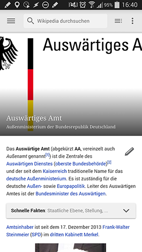

--

Das Menü ist Teil des Navigationsrahmens und bleibt stets in der Systemsprache.

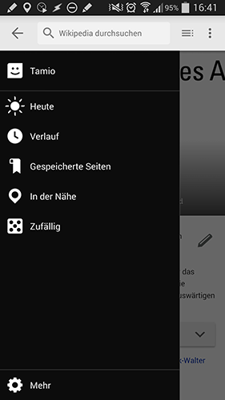

--

Im Einstellungsbereich der App kann der Nutzer die Sprache der Inhalte definieren.

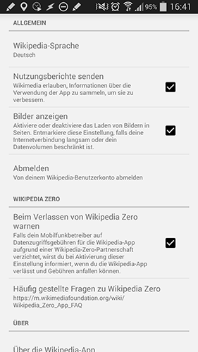

--

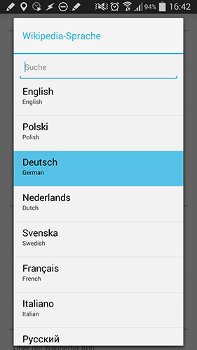

--

Unabhängig von den Einstellungen kann der Nutzer im Bedarfsfall einen Artikel in einer anderen Sprache aufrufen ...

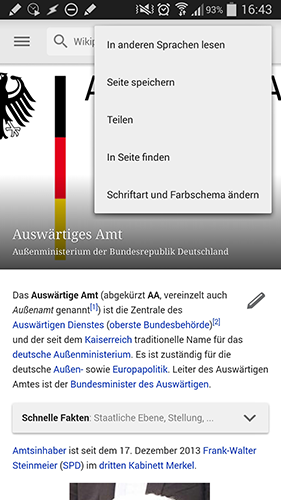
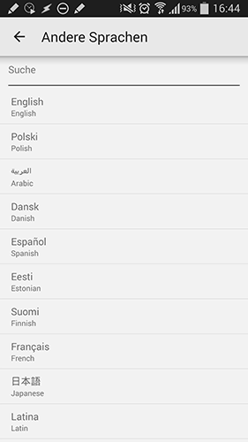
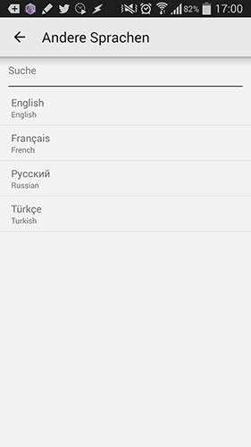

--

... dabei bleiben die Navigation und Labels in der gewohnten Systemsprache.

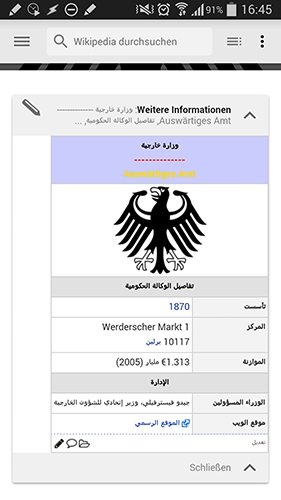

--

Die zuletzt gewählten Sprachen sind in der Auswahlliste oben.

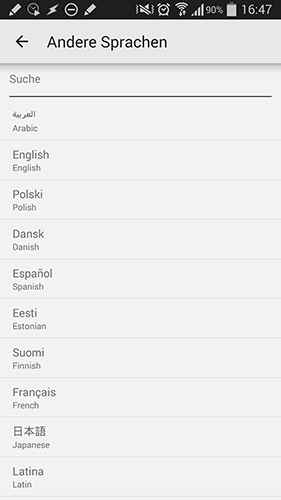

--

Falls keine andere Sprache für den Artikel vorliegt, wird der Nutzer darauf hingewiesen.

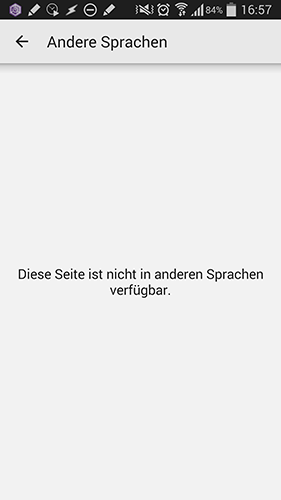

---

## Systemeinstellungen für die App-Sprache

--

--

iOS erlaubt die Wahl der Hauptsprache und einer Reihenfolge von bevorzugten Sprachen.

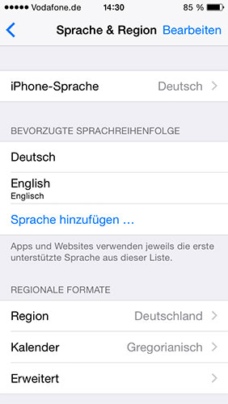

--

Android erlaubt die Wahl lediglich einer Systemsprache.

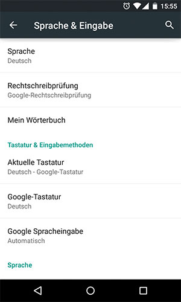

---

## Lösungsansätze

--

Variante _dezenter Hinweis_ #1

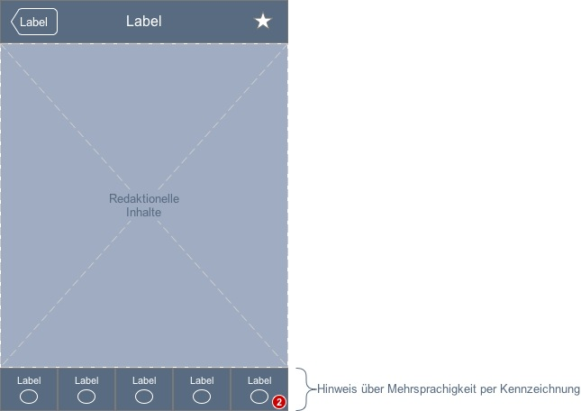

--

Variante _dezenter Hinweis_ #2

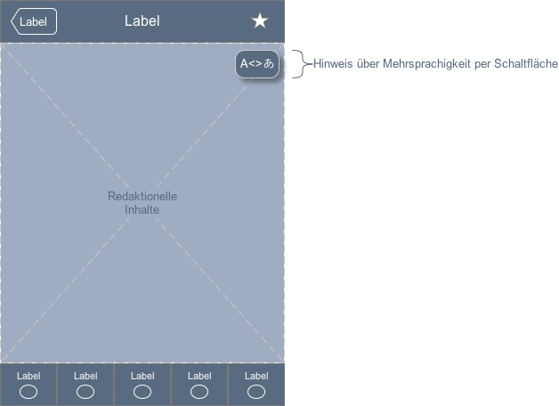

--

Variante _Sprachsystem_

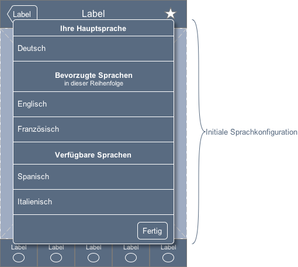

--

### Mögliches Sprachoptimierungspaket

1. Analyse der Sprachanforderungen
1. Implementation eines anonymisierten Sprachen-Trackings
1. Ableitung eines Sprachkonzepts
1. Implementation des Sprachkonzepts in App und CMS

---

## Weiteres Optimierungspotential

* App-Tracking als Optimierungsgrundlage
* Usability-Labortest
* Usability-Optimierungen
* Unterstützung weiterer Nutzungsszenarien
* Android Material Design
* iOS Flat-Design ausbauen

--

### App-Tracking

Aussagen über ...

* Verteilung der Sprachen
* Interesse an Inhalten nach Regionen, Geräteklassen, ...
* Klickpfade
* Anomalien in der Bedienung / Usability-Probleme

--

### Labortest

* Auswahl der Probanden nach Zielgruppen
* Test der wichtigsten Inhalte
* Usability-Probleme
* Wünsche der Nutzer

--

### Usability-Optimierungen

* Navigation und Orientierung
* Symbolsprache und Begrifflichkeiten
* Gesten
* Accessibility

--

### Unterstützung weiterer Nutzungsszenarien

* Flugmodus / Roamingkostenreduktion für Reisende (Offline-Inhalte)
* Benachrichtigungen für wichtige Mitteilungen (Favoriten)
* News-Benachrichtigungen für Smartwatches
* Nützliche Tools für die Zielgruppe

--

### Material Design

* Zeitgemäße App
* Verbesserte Interaktionsmuster
* Anprechendes Redesign
* Unterstützung neuer System-Features

--

### iOS Flat Design

* Weitere Modernisierung der App
* Redesign einiger Bereiche nach Usability-Analyse
* Unterstützung weiterer System-Features
* iPhone 6 Plus Optimierung

---

# Danke