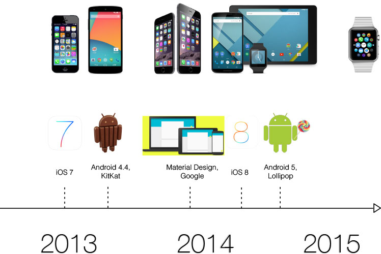
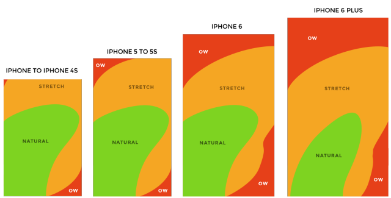
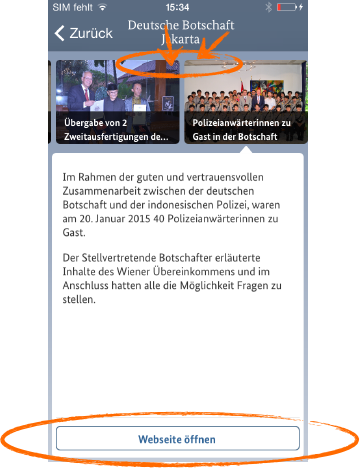
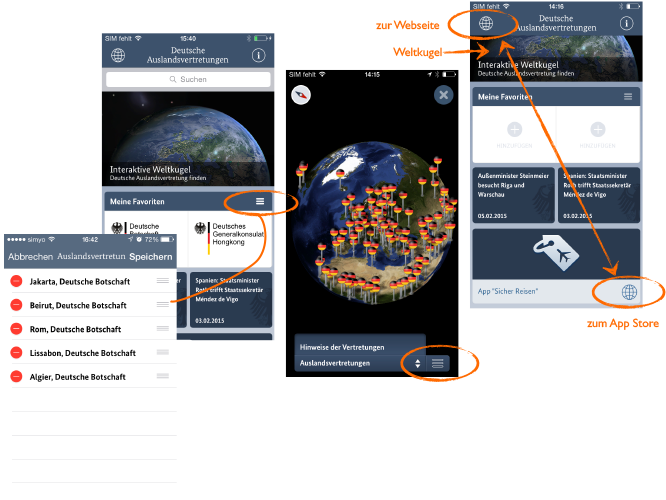
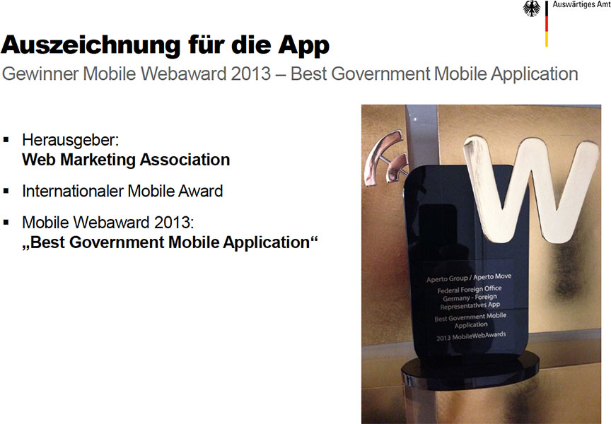

# Auswärtiges Amt
## Sprach-Update der App

--

## Agenda

1. Vorstellung<!-- .element: class="fragment" data-autoslide="200" -->
1. Einführung<!-- .element: class="fragment" data-autoslide="200" -->
1. Problemstellung<!-- .element: class="fragment" data-autoslide="200" -->
1. Vergleichbare App<!-- .element: class="fragment" data-autoslide="200" -->
1. Optimierungsansätze<!-- .element: class="fragment" data-autoslide="200" -->
1. Mögliche Updates<!-- .element: class="fragment" data-autoslide="200" -->
1. Nächste Schritte<!-- .element: class="fragment" -->

---

## Vorstellung

---

## Ziel des Termins

--

**Anfrage zur Berücksichtigung der Spracheinstellung.**

_(Tickets: AVCMS-4109, AVCMS-4100, AVCMS-4099, AVCMS-4105)_

--

**Weiterentwicklung der App.**

---

## Einführung

--

## Systemeinstellungen für die App-Sprache

--

iOS erlaubt die Wahl der Hauptsprache und einer Reihenfolge von bevorzugten Sprachen.

--

Android erlaubt die Wahl lediglich einer Systemsprache.

--

## Klassifikation der App

--

Reader-App

--

Sprach-Container

--

Kombinationsbeispiele

---

## Problemstellung der Sprachauswahl

--

Die Systemeinstellung für die Sprache wird ignoriert.

--

Redaktionelle Inhalte werden auf Deutsch abgerufen.

--

Redaktionelle Inhalte und der Navigationsrahmen werden nach Sprachwahl zugleich ausgetauscht.

--

Bei Verlassen einer Auslandsvertretung wechselt die App generell auf Deutsch.

--

Meist ist nur eine Sprache in der Auswahlliste.

--

Selten sind drei Sprachen in der Auswahlliste.

--

Ab und zu ist keine Sprache aufgelistet.

--

Nutzer bekommen den Eindruck, es gäbe allgemein die erstmalig gesehenen Sprachen zur Auswahl.

---

## Vergleichbare App: Wikipedia

--

Navigationsrahmen und Inhalt entsprechen der Systemsprache.

--

Das Menü ist Teil des Navigationsrahmens und bleibt stets in der Systemsprache.

--

Im Einstellungsbereich der App kann der Nutzer die Sprache der Inhalte definieren.

--

--

Unabhängig von den Einstellungen kann der Nutzer im Bedarfsfall einen Artikel in einer anderen Sprache aufrufen ...

--

... dabei bleiben die Navigation und Labels in der gewohnten Systemsprache.

--

Die zuletzt gewählten Sprachen sind in der Auswahlliste oben.

--

Falls keine andere Sprache für den Artikel vorliegt, wird der Nutzer darauf hingewiesen.

---

## Lösungsansätze

--

Variante _dezenter Hinweis_ #1

--

Variante _dezenter Hinweis_ #2

--

Variante _Sprachsystem_

--

### Mögliches Sprachoptimierungspaket

1. Analyse der Sprachanforderungen
1. Implementation eines anonymisierten Sprachen-Trackings
1. Ableitung eines Sprachkonzepts
1. Implementation des Sprachkonzepts in App und CMS

---

## Weiteres Optimierungspotential

--

<!-- -- data-background-transition="fade" data-background="assets/bg_analytics.jpg" -->

### App-Tracking

Aussagen über ...

* Verteilung der Sprachen
* Interesse an Inhalten nach Regionen, Geräten, ...
* Klickpfade
* Anomalien in der Bedienung / Usability-Probleme

--

<!-- -- data-background-transition="fade" data-background="assets/bg_uselab.jpg" -->

### Labortest

* Auswahl der Probanden nach Zielgruppen
* Test der wichtigsten Inhalte
* Usability-Probleme
* Wünsche der Nutzer

--

<!-- -- data-background-transition="fade" data-background="assets/bg_usability.jpg" -->

### Usability-Optimierungen

* Navigation und Orientierung
* Symbolsprache und Begrifflichkeiten
* Gesten
* Accessibility

--

### Unterstützung weiterer Nutzungsszenarien

--

<!-- -- data-background-transition="fade" data-background="assets/bg_flugmodus.jpg" -->

**Flugmodus / Roamingkostenreduktion im Ausland**

Offline-Inhalte

--

<!-- -- data-background-transition="fade" data-background="assets/bg_push-notification.jpg" -->

**Benachrichtigungen für wichtige Mitteilungen**

für Favoriten

--

<!-- -- data-background-transition="fade" data-background="assets/bg_smartwatch.jpg" -->

**News-Benachrichtigungen auf Smartwatches**

--

**Nützliche Tools für die Zielgruppe**

Bspw.

* Export der Kontaktdaten ins Adressbuch
* Nächstliegende Auslandsvertretung
* Verlauf aufgerufener Auslandsvertretungen

--

<!-- -- data-background-transition="fade" data-background="assets/bg_material-design.jpg" -->

### Material Design

* Zeitgemäße App
* Verbesserte Interaktionsmuster
* Anprechendes Redesign
* Unterstützung neuer System-Features

--

<!-- -- data-background-transition="fade" data-background="assets/bg_flat-design.jpg" -->

### iOS Flat Design

* Weitere Modernisierung der App
* Redesign einiger Bereiche nach Usability-Analyse
* Unterstützung weiterer System-Features
* iPhone 6 Plus Optimierung

---

## Beispiele zu den Optimierungsvorschlägen

--

### Erreichbarkeit mit dem Daumen im iPhone 6 Plus

--

iPhone 6 Plus und Slider-Platzierung

--

### Symbolsprache

---

## Remote Testing

| Anbieter | Geräte | Kosten |
|----------|----------|----------|
| [TestObject](https://testobject.com/) | > 120 / iOS & Android | ab 89$ / Monat, ausgewählte Geräte umsonst |
| [AppThwack](https://appthwack.com/) | 326 / iOS & Android | ab 20$ / Monat |
| [TestDroid](http://testdroid.com/) | > 100 / iOS & Android | ab 500$ / Monat |
| [Keynote](http://www.keynote.com/solutions/testing/mobile-testing) | > 500 | ab 180$ / Monat, ausgewählte Geräte umsonst |
| [Xamarin](http://xamarin.com/test-cloud) | ~ 1000 | ab 1000$ / Monat |

---

## Nächste Schritte

1. Sprachkonzept & Umsetzung
1. Weitere Tickets lösen
1. Entscheidung zu weiteren Optimierungsmöglichkeiten

---

